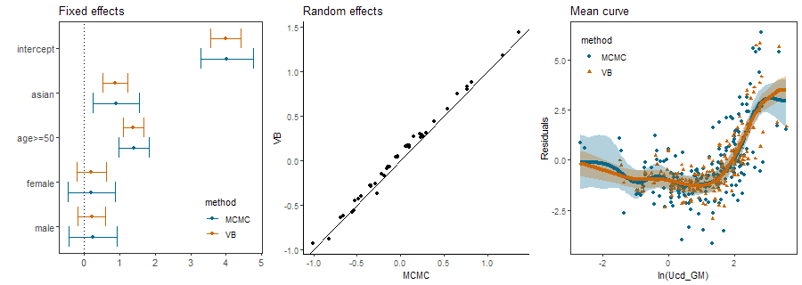

# Semiparametric Mixed Effects Models using Variational Inference

Linear mixed effects model refers to the linear model which contains both fixed effects and random effects. <b>This model is useful for analysis of repeated observartions on multiple subjects</b>, as effect of each subject can be estimated through random effect.

With this concept in mind, <b>semiparametric mixed effects model refers to the linear mixed effect model where nonparametric estimation is conducted</b>. This includes estimation on

- unknown density of random effect
- unknown functional relationship between certain variate and response variable

Unknown density and functional relationship can be estimated by adopting mixture of Dirichlet Process prior(DPM) and Gaussian Process prior(GP) respectively.

This repository contains implementation of two types of semiparametric mixed effects model: Random Intercept model and Stochastic Frontier model. Random effect of each model is estimated by adopting DPM while each contains a variate whose relationship with response variable is nonlinear and therefore should be estimated by adopting GP prior. Especially, <b>every code is implemented using Variational inference, which is shown to be 1,000~5,000 times faster compared to MCMC</b>, while maintaining similar level of accuracy. For simplicity, result for Random Intercept model is only presented in this README.

## Random Intercept model

This model <b>assumes random effect to be any real value</b>. As distribution whose support matches that restriction is normal, random effect is modeled as a mixture of normal distributions. 

### Simulation Study

In simulation study, 5 repeated observations for 50 subjects are generated. Random effects are generated from mixture of 3 different normal distributions and effect of increasing sin wave is added. Specifically, random effect u and nonlinear relationship f are defined as:

```R
f = function(x) 2*x*sin(pi*x)
mu1 = 3; mu2 = 0; mu3 = -3
assigner = runif(N) # N is a number of subjects, which is 50
u = rnorm(N, mu1, 0.36) 
u[assigner > 0.33] = rnorm(sum(assigner > 0.33), mu2, 0.36)
u[assigner > 0.66] = rnorm(sum(assigner > 0.66), mu3, 0.36)
```

Result of simulation follows. Each of black point and orange intervals in plots for fixed, random effects represents true value of each effect and estimated 95% credible intervals respectively. In the plot for mean curve, black points and orange curve illustrates residual and estimated mean curve. Shaded orange area around the curve indicates 95% credible region that curve can vary. As almost every interval includes true value and predefined pattern is captured, implemented algorithm returns valid result.


### Real data anaylsis

To compare this method with MCMC counterpart, meta-analysis data collected from various articles published by European Food Safety Authority(EFSA) and National Cancer Center of Korea is used. This dataset is collected to verify dose-response relationship between cadmium concentration in kidney and renal dysfunction. Dataset contains 309 meta data from 41 articles on 

Variable | Explanation
---------|------------
ethnicity|Indicator of ethnicity composition(Asian/Caucasian)
age>=50|Indicator of average age being above 50
gender|Indicator of gener composition(Female/Male/Mixed)
Ucd_GM|Geometric mean of urinal cadmium density
b2_GM|Geometric mean of density of protein called beta2-microglobulin

- Increase of beta2-microglobulin is known to indicate renal dysfunction, so it becomes response variable.
- Demographic indicators will compose parametric part of the model.
- To cover possible study-specific effect, constant random effect of each study will be estimated through DPM.
- Nonlinear relationship between Ucd_GM and b2_GM will be estimated using GP prior.

In this setting, both Variational Inference(or VB, Variational Bayes) and MCMC was deployed to conduct inference. Below plots compare the output returned by each method, and implication of each plot is explained below. 



- In the fixed effects plot, each horizontal interval and point at the middle represents 95% credible interval and estimated mean value of fixed effects respectively. This plot implies that each method returned result that is similar to another.
- In the random effects plot, line in the middle represents y=x line and each black point around the line is a pair of coordinates composed by posterior mean of each random effect estimated by each method. Points will be concentrated to this line if two coordinates are similar. Since this is the case, this plot also implies that each method returned result that is similar to another.
- Mean curve plot illustrates two types of residuals and mean curves with 95% credible regions. As both curve shows increasing convex shape, this plot also implies that each method returned result that is similar to another.

As explained, estimation result were similar, but elapse time of each method wasn't. For VB method, it was 0.093 second, while that of MCMC was 94.55 seconds. In short, <b>variational inference returned similarly accurate result compared to MCMC, while almost 1,016 times faster</b>.
